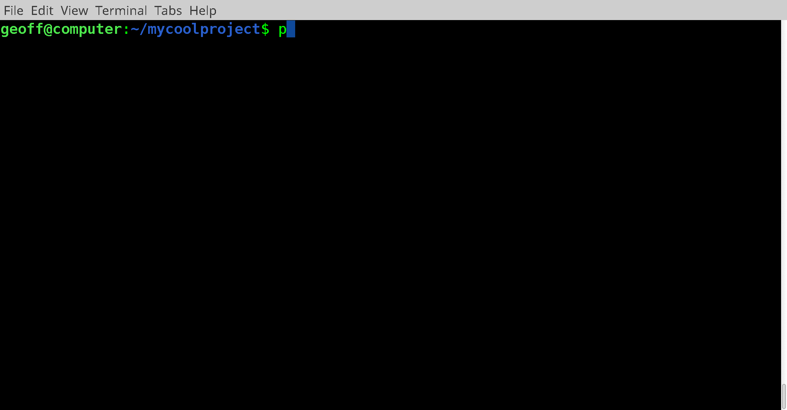

# PDQTest

PDQTest - Puppet Docker Quick-test - is the quickest and easiest way to test 
your puppet modules for Linux and Windows.

PDQTest features:
* Static analysis testing (PDK):
    * Metadata
    * Syntax
    * Linting
    * RSpec
* Acceptance testing for Linux and Windows:
    * [BATS-core](https://github.com/bats-core/bats-core)
    * [PATS](https://github.com/declarativesystems/pats) (Experimental)

PDQTest acceptance tests can be retrofitted to and PDK enabled module by running
`pdqtest init`.

PDQTest runs static analysis tests within the machine it is running from and 
then loads a docker container to perform acceptance testing, sharing the puppet
module and cached dependencies from your host.

This way you can destructively test your module without risking the host.

_Adding PDQTest to a project and running acceptance tests in Docker_

## PDQTest 2.0 Release notes
PDQTest 2.0 new features:
* [PDK Support](doc/pdk.md)
* [Windows support](doc/windows.md)
* [PDQTest 1.x -> 2.x Upgrade guide](doc/upgrade_1_2.md)
* [Inplace execution](https://github.com/declarativesystems/pdqtest/issues/34)

## PDQTest Manual
1. [Installation](doc/installation.md)
1. [Enabling testing](doc/enabling_testing.md)
1. [Running tests](doc/running_tests.md)
1. [Acceptance tests](doc/acceptance_tests.md)
1. [Windows](doc/windows.md)
1. [PDK Integration](doc/pdk.md)
1. [Puppet module dependencies](doc/puppet_module_dependencies.md)
1. [Test generation](doc/test_generation.md)
1. [Puppet facts](doc/puppet_facts.md)
1. [Hiera](doc/hiera.md)
1. [Caching](doc/caching.md)
1. [Emoji](doc/emoji.md)
1. [Upgrading](doc/upgrading.md)
1. [Tips and tricks](doc/tips_and_tricks.md)
1. [Troubleshooting](doc/troubleshooting.md)
1. [Examples](doc/examples.md)
1. [Development](doc/development.md)
1  [Inplace execution](doc/inplace.md)
1. [PDQTest 1.x -> 2.x Upgrade guide](doc/upgrade_1_2.md)